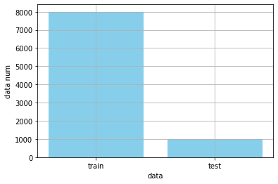
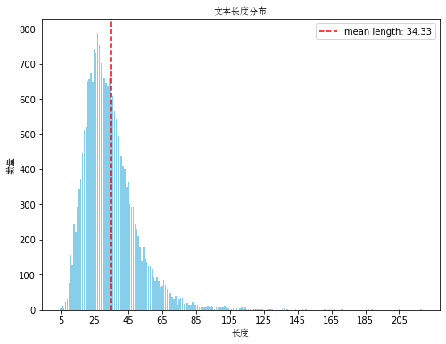
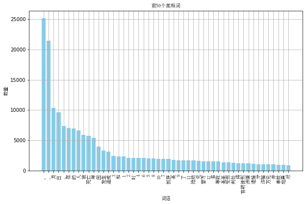
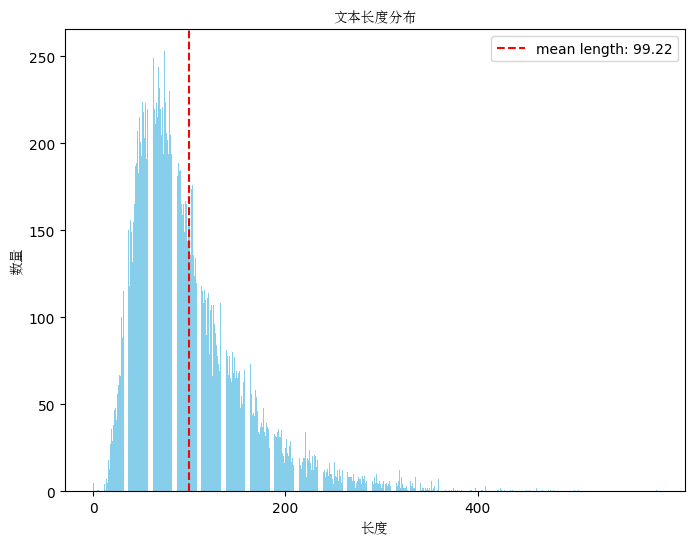
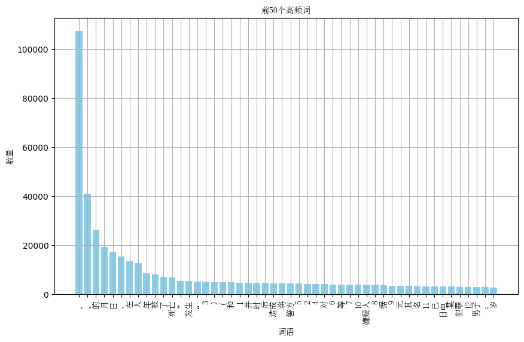
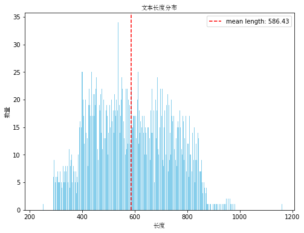
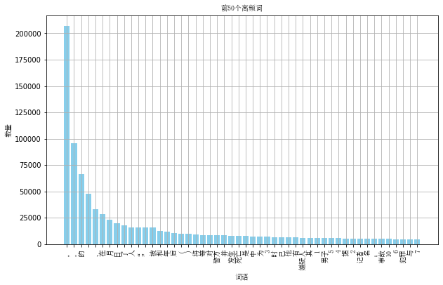

# abstract_tianchi
面向篇章级文本的突发事件摘要生成任务评测

比赛链接：https://github.com/qiyuanlanniao/abstract_tianchi/invitations

任务类型，给定source_text输出target_text，摘要任务，初步考虑transformer结构

# 文件说明
```
|---abstract_tianchi
    |--- figs                                           # 项目中用到的图片
    |--- data_analysis.ipynb                            # 数据集分析
    |--- data_process                                   # 各种数据处理文件夹
        |--- process_v1.py                              # 输入为events文本，输出为target文本
    |--- SimSun.ttf                                     # 中文ttf
    |--- utils.py                                       # 工具包
    |--- finetune.py                                    # 模型训练代码
    |--- evaluate.py                                    # 模型评估
    |--- predict.py                                     # 输出预测文件，提交成绩
```


# 一、数据分析

## 0. 数据量

训练集合和预测集合




## 1. summarization文本分析

summarization即为模型的输出



文本最短长度 5 文本最大长度 218

平均长度为34.33，在transformer生成预测文本的时候长度可以设置为200

输出文本的高频词



词云图


## 2. envets文本分析

events要作为模型的输入



文本最短长度 0 文本最大长度 586

平均长度99.22

**模型输入可以设置为512**

events文本的高频词



词云图


## 3. doc文本分析

doc文本作为候选特征



文本最短长度 228 文本最大长度 1161

平均长度586

**模型输入可以设置为512**

events文本的高频词



词云图


## 4. 文本长度表格汇总

|       | 文本最短长度 | 文本最大长度 | 平均长度   |
|-------|--------------|--------------|-----------|
| doc文本 | 228          | 1161         | 586       |
| events文本 | 0            | 586          | 99.22     |
| summarization文本 | 5            | 218          | 34.33     |


# 二、finetune阶段


## 1. 只对events考虑做summarize
两个模型：BART、Pegasus

1. BART中文预选训练下载源：https://huggingface.co/fnlp/bart-base-chinese/tree/main

2. Pegasus中文与训练下载源：https://huggingface.co/uer/pegasus-base-chinese-cluecorpussmall
   
## 2. 考虑对doc长文本做特征提取然后一起喂入Transformer-encoder

# 三、Pretrain阶段
> 引入pretrain任务


# 成绩记录

# 分工记录

A ： 
|时间|记录|
|-----|----------|
|0531|数据集Summarization+doc文本分析|
|0531|数据文本整理`process_v1.py`，和Bart模型搭建`train.py` |
|0601|添加评测代码|
|     |          |
|     |          |

B ： 

|时间|记录|
|-----|----------|
|0528|evetns文本分析|
|0531|训练和验证集固定划分，避免交叉          |
|0601|Pegasus+process_v1|
|     |          |
|     |          |


# 参考文献
- [1] BART: Denoising Sequence-to-Sequence Pre-training for Natural Language Generation, Translation, and Comprehension
- [2] PEGASUS: Pre-training with Extracted Gap-sentences for Abstractive Summarization

