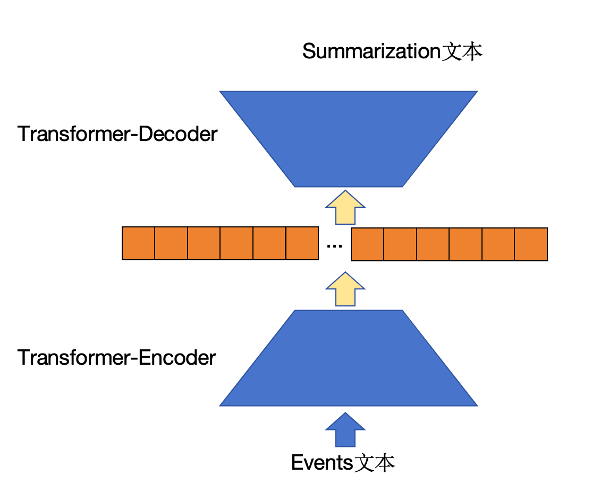

# abstract_tianchi
面向篇章级文本的突发事件摘要生成任务评测

比赛链接：https://github.com/qiyuanlanniao/abstract_tianchi/invitations

任务类型，给定source_text输出target_text，摘要任务，初步考虑transformer结构

# 文件说明
```
|---abstract_tianchi
    |--- figs                                           # 项目中用到的图片
    |--- data_analysis.ipynb                            # 数据集分析
    |--- data_process                                   # 各种数据处理文件夹
        |--- process_v1.py                              # 输入为events文本，输出为target文本
    |--- SimSun.ttf                                     # 中文ttf
    |--- utils.py                                       # 工具包
    |--- finetune.py                                    # 模型训练代码
    |--- evaluate.py                                    # 模型评估
    |--- predict.py                                     # 输出预测文件，提交成绩
    |--- requirements.txt                               # 项目需要的python三方库
```

# 0. 项目环境配置

首先确保python环境在3.8以上，python环境下载请到[官网](https://www.python.org)。

下载好python之后，直接cd到这个项目文件夹下，然后输入`pip install -r requriements.txt -i  https://pypi.tuna.tsinghua.edu.cn/simple`

下载完成之后则环境配置成功。

配置成功之后按照下面的流程执行


- a. 数据集下载到目录里
- b. 创建一个model_weights目录里，把bart和pegasus的预训练权重下载到model_weights目录里，两个预训练权重后面有附带链接
- c. 先运行split.py划分训练集合和验证集合，避免数据交叉，
- d. 运行dataprocess/process_v1.py或者_v2.py处理数据格式。
- e. 运行finetune_bart.py或者finetune_pegasus.py，

目前暂时选择了bart进行了预训练，加入预训练之后的流程如下：

- a. 数据集下载到目录里
- b. 创建一个model_weights目录里，把bart预训练权重下载到model_weights目录
- c. 先运行split.py划分训练集合和验证集合，避免数据交叉，
- d. 运行dataprocess/process_v2.py得到预训练数据集格式
- e. 运行dataprocess/process_v1.py得到微调任务数据格式
- f. 运行pretrain_bart.py得到bart预训练权重
- g. 修改finetune_bart.py里面的权重加载，然后运行finetune_bart.py

# 一、数据分析

## 0. 数据量

训练集合和预测集合


## 1. summarization文本分析

summarization即为模型的输出


文本最短长度 5 文本最大长度 218

平均长度为34.33，在transformer生成预测文本的时候长度可以设置为200

输出文本的高频词


词云图


## 2. envets文本分析

events要作为模型的输入


文本最短长度 0 文本最大长度 586

平均长度99.22

**模型输入可以设置为512**

events文本的高频词


词云图


## 3. doc文本分析

doc文本作为候选特征


文本最短长度 228 文本最大长度 1161

平均长度586

**模型输入可以设置为512**

events文本的高频词


词云图


## 4. 文本长度表格汇总

|       | 文本最短长度 | 文本最大长度 | 平均长度   |
|-------|--------------|--------------|-----------|
| doc文本 | 228          | 1161         | 586       |
| events文本 | 0            | 586          | 99.22     |
| summarization文本 | 5            | 218          | 34.33     |


# 二、finetune阶段



## 1. 只对events考虑做summarize
两个模型：BART、Pegasus

1. BART中文预选训练下载源：https://huggingface.co/fnlp/bart-base-chinese/tree/main

2. Pegasus中文与训练下载源：https://huggingface.co/uer/pegasus-base-chinese-cluecorpussmall
   
## 2. 考虑对doc长文本做特征提取然后一起喂入Transformer-encoder

# 三、Pretrain阶段
> 引入pretrain任务


# 成绩记录

A ： 
|提交时间|线上成绩|提交权重|训练方法|
|-----|----------|----------|----------|
|0601|73.9568|bart_datav1/model_ep4.pth|bart+process_v1.py|
|0601|74.5067|bart_datav1/model_ep8.pth|bart+process_v1.py|
|0602|74.4410|bart_datav1/model_ep9.pth|微调了一些参数，bart+process_v1.py|
|0602|74.6428|bart_datav1/model_ep9.pth|微调了一些参数，bart+process_v1.py|
|0604|74.6428|bart_datav2/model_ep9.pth|微调了一些参数，bart+process_v1.py|
|0605|70.2784|bart_pretrain_datav1/model_ep9.pth|添加了预训练|
|0605|69.9692|bart_pretrain_datav1/model.pth|添加了预训练|

B ： 
|提交时间|线上成绩|提交权重|训练方法|
|-----|----------|----------|----------|
|0601|46.5899|pegasus/model_ep8.pth|pegasus+process_v1.py|
|0602|56.9|调了参数,pegasus/model_ep8.pth|pegasus+process_v1.py|


# 分工记录

A ： 
|时间|记录|
|-----|----------|
|0525-0527|选择赛题，了解git，阅读相关文件|
|0531|数据集Summarization+doc文本分析|
|0531|数据文本整理`process_v1.py`，和Bart模型搭建`train.py` |
|0601|添加评测代码|
|0601|优化了predict.py代码，从原来的1h推理时延降低到10min|
|0601|提交了两版成绩，暂时排名第八|
|0602|调研了transformer的pretrain方法，计划尝试做一下pretrain|
|0603|改进了pretrian的数据集|
|0604|添加了模型pretrain的代码|

B ： 

|时间|记录|
|-----|----------|
|0525-0527|选择赛题，了解git，阅读相关文件|
|0528|evetns文本分析|
|0531|训练和验证集固定划分，避免交叉          |
|0601|Pegasus+process_v1|
|0601|预测代码|
|0601|提交了pegasus模型，成绩只有46.5899|
|0602|提交了pegasus模型，调了一下参数，成绩只有56.9|
|0603|处理预训练文本，为了避免数据交叉，选择doc和content作为预训练文本|
|0604|配置环境汇总成requirement|

# 实验平台
腾讯云2080ti，12G

# 参考文献
- [1] BART: Denoising Sequence-to-Sequence Pre-training for Natural Language Generation, Translation, and Comprehension
- [2] PEGASUS: Pre-training with Extracted Gap-sentences for Abstractive Summarization

