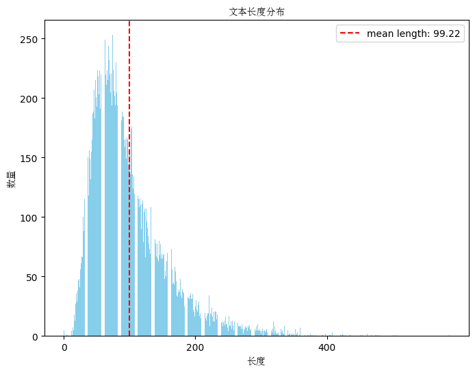

# 报告说明

1. 数据集说明
2. transformer结构原理
3. 所采用方案模型说明
4. bart和pegasus模型对比
5. bart与预训练任务
6. 待尝试方案
7. 

# 1. 数据集分析与说明
## 1.1 数据集说明
比赛链接[https://tianchi.aliyun.com/competition/entrance/532190/rankingList](https://tianchi.aliyun.com/competition/entrance/532190/rankingList)

训练集为json文件，文件中的一行是一个训练实例，包含输入文本X、目标事件关系及类型。在训练数据发布阶段，我们会发布8000条左右的训练集。

测试集分A榜测试集和B榜测试集，均为json文件，分别包含1000条数据，文件中的一行是一个测试实例，包含输入文本X。测试集所覆盖的事件类型与训练集一致，但各类型的样本分布可能不一致。

输入：一段文本和其事件列表

输出：文本的事件摘要列表

输入字段介绍：

"new-ID"：输入文本的ID

"doc"：输入文本

"events"：输入文本的事件列表，其中每个事件包含：

`"id"：事件id, "content"：事件的原始描述，为输入文本的句子或句群，"spans"为句子/句群在输入文本中的索引`

输出字段介绍：

"summarizations"：事件摘要列表，其中每个摘要包含：

`"id"：事件id, "event-summarization"：事件摘要`

评价指标

本次任务使用基于词汇相似度的自动评估指标ROUGE值来评估摘要质量。具体地，使用了Porter stemmer选项的ROUGE-L指标的full-length F1分数：
$$R_lcs=(LCS(H，S))/(Length(S))$$

$$P_lcs=(LCS(H，S))/(Length(H))$$

$$ROUGE-L=F_lcs=((1+β^2)R_lcs·P_lcs)/(R_lcs+β^2·P_lcs)$$

其中，LCS(H，S)是候选摘要H和参考摘要S之间最长公共子序列的长度，Length(S)是参考摘要S的长度。

## 1.2 数据集分析
####  数据量

训练集合和预测集合

#### summarization文本分析

summarization即为模型的输出

文本最短长度 5 文本最大长度 218

平均长度为34.33，在transformer生成预测文本的时候长度可以设置为200

输出文本的高频词

词云图

#### envets文本分析

events要作为模型的输入

文本最短长度 0 文本最大长度 586

平均长度99.22

**模型输入可以设置为512**

events文本的高频词

词云图

#### doc文本分析

doc文本作为候选特征

文本最短长度 228 文本最大长度 1161

平均长度586

**模型输入可以设置为512**

events文本的高频词

词云图

#### 文本长度表格汇总

|       | 文本最短长度 | 文本最大长度 | 平均长度   |
|-------|--------------|--------------|-----------|
| doc文本 | 228          | 1161         | 586       |
| events文本 | 0            | 586          | 99.22     |
| summarization文本 | 5            | 218          | 34.33     |

# 2. transformer结构以及训练方法

文本考虑的为摘要任务，因此采用transformer完整的encoder-decoder结构[1]。

## 2.1 Transformer模型结构原理

Transformer模型由Vaswani等人在2017年提出，是一种基于注意力机制的神经网络模型，专门用于处理序列到序列的任务，如机器摘要。与传统的RNN和LSTM模型相比，Transformer具有更好的并行计算能力和长距离依赖关系的捕捉能力。

### 2.1.1 模型架构

Transformer的架构包括编码器（Encoder）和解码器（Decoder）两部分，每部分由多个相同的层（Layer）堆叠而成。每层又由两个子层（Sub-layer）组成：

1. 自注意力机制（Self-Attention Mechanism）
2. 前馈神经网络（Feed-Forward Neural Network）

每个子层之后都接有层归一化（Layer Normalization）和残差连接（Residual Connection）。

#### 自注意力机制

自注意力机制是Transformer的核心，它允许模型在计算一个单词的表示时，参考输入序列中的所有单词。自注意力机制的计算过程如下：

1. 输入序列的表示为 $\mathbf{X} = [\mathbf{x}_1, \mathbf{x}_2, \ldots, \mathbf{x}_n]$，其中每个$\mathbf{x}_i \in \mathbb{R}^{d_{model}}$。
2. 对输入序列计算三个矩阵：查询（Query）矩阵$\mathbf{Q}$，键（Key）矩阵$\mathbf{K}$和值（Value）矩阵$\mathbf{V}$：
   $$
   \mathbf{Q} = \mathbf{X}\mathbf{W}^Q, \quad \mathbf{K} = \mathbf{X}\mathbf{W}^K, \quad \mathbf{V} = \mathbf{X}\mathbf{W}^V
   $$
   其中，$\mathbf{W}^Q, \mathbf{W}^K, \mathbf{W}^V \in \mathbb{R}^{d_{model} \times d_k}$是可学习的权重矩阵。

3. 计算注意力权重矩阵$\mathbf{A}$：
   $$
   \mathbf{A} = \text{softmax}\left(\frac{\mathbf{Q}\mathbf{K}^T}{\sqrt{d_k}}\right)
   $$
   其中，$\frac{1}{\sqrt{d_k}}$是缩放因子，用于防止内积值过大。

4. 计算自注意力的输出：
   $$
   \text{Attention}(\mathbf{Q}, \mathbf{K}, \mathbf{V}) = \mathbf{A}\mathbf{V}
   $$

#### 多头注意力机制

为了增强模型的表示能力，Transformer使用了多头注意力机制（Multi-Head Attention）。具体来说，多个自注意力机制并行执行，每个头都有独立的查询、键和值，然后将所有头的输出拼接并通过一个线性变换：

$$
\text{MultiHead}(\mathbf{Q}, \mathbf{K}, \mathbf{V}) = \text{Concat}(\text{head}_1, \ldots, \text{head}_h)\mathbf{W}^O
$$

其中，每个头的计算为：

$$
\text{head}_i = \text{Attention}(\mathbf{Q}\mathbf{W}^Q_i, \mathbf{K}\mathbf{W}^K_i, \mathbf{V}\mathbf{W}^V_i)
$$

#### 前馈神经网络

在每个编码器和解码器层中，自注意力机制之后是一个前馈神经网络。这个网络由两个线性变换和一个ReLU激活函数组成：

$$
\text{FFN}(\mathbf{x}) = \max(0, \mathbf{x}\mathbf{W}_1 + \mathbf{b}_1)\mathbf{W}_2 + \mathbf{b}_2
$$

#### 编码器和解码器

Transformer的编码器由若干相同的编码器层堆叠而成，每个编码器层包括一个多头自注意力机制和一个前馈神经网络。编码器的输入是词嵌入与位置编码的和。

解码器结构类似于编码器，但多了一个编码器-解码器注意力层，用于对编码器的输出进行注意力计算。解码器的输入是目标序列的词嵌入与位置编码的和，输出为预测的目标序列。

## 2.2 文本摘要任务的训练方法

在文本摘要任务中，训练Transformer模型需要大量的平行语料，即源语言和目标语言的句子对。训练过程通常包括数据预处理、模型训练和评估三个阶段。

### 2.2.1 数据预处理

数据预处理是指对原始数据进行清洗、规范化和转换，具体步骤包括：

1. **清洗数据**：移除无效字符和噪声，如HTML标签、特殊符号等。
2. **分词**：将句子拆分为单词或子词（通常使用Byte Pair Encoding，BPE算法）。
3. **构建词汇表**：统计词频并创建源语言和目标语言的词汇表。
4. **序列化**：将单词转换为对应的词汇表索引。
5. **添加特殊符号**：在每个句子前后添加起始符和结束符，标记句子开始和结束。
6. **位置编码**：为每个词添加位置编码，以便模型识别词的位置。

### 2.2.2 模型训练

模型训练是指使用训练数据调整模型参数，使其能够生成高质量的摘要结果。训练过程包括以下步骤：

1. **初始化参数**：随机初始化模型的权重矩阵。
2. **正向传播**：将输入序列通过编码器和解码器，计算输出序列的预测概率。
3. **计算损失**：使用交叉熵损失函数衡量模型输出与目标序列之间的差异：
   $$
   \mathcal{L} = -\frac{1}{N}\sum_{i=1}^{N} \sum_{t=1}^{T} \log P(y_t^i | y_{<t}^i, \mathbf{X}^i)
   $$
   其中，$N$是批量大小，$T$是目标序列长度，$P(y_t^i | y_{<t}^i, \mathbf{X}^i)$是模型预测在时刻$t$生成单词$y_t^i$的概率。
4. **反向传播**：计算损失函数相对于模型参数的梯度。
5. **参数更新**：使用优化算法（如Adam）更新模型参数。
6. **验证**：在验证集上评估模型性能，并进行超参数调整。

### 2.2.3 模型评估

模型评估是指使用测试数据衡量模型的实际摘要性能。常用的评估指标为**BLEU（Bilingual Evaluation Understudy）**，用于衡量机器摘要输出与参考摘要之间的n-gram重叠情况。

在实际应用中，通常还需要进行超参数调整、模型集成和后处理，以进一步提高摘要质量。

# 3. 所采用方案模型说明
在本文中采用了两个预训练模型进行训练，两个模型都是transformer结构，不同点在于预训练任务的不同。

不同预训练任务对下游任务的影响也有差异。

## 3.1 Pegasus模型简介

Pegasus（Pre-training with Extracted Gap-sentences for Abstractive Summarization Sequence-to-sequence models）是由Google Research团队提出的一种专门用于生成性任务（如摘要生成）的预训练模型[2]。Pegasus在预训练过程中使用了一种新的策略，通过从文档中提取并掩盖部分句子，然后让模型去生成这些句子，从而使其能够更好地理解文档的整体结构和内容。该模型在多个摘要生成任务上表现出了强大的能力。

Pegasus的基本结构与Transformer类似，采用了编码器-解码器架构。编码器负责理解输入文本的内容，而解码器则生成输出文本。Pegasus的创新之处在于其预训练方法和生成任务的设计。

#### Pegasus 预训练任务

Pegasus的预训练任务被称为Gap Sentence Generation（GSG），其核心思想是通过从文档中随机抽取句子并将其掩盖，训练模型生成这些被掩盖的句子。这一过程类似于“填空”游戏，旨在增强模型的整体理解能力。

具体步骤如下：

1. 从文档中提取多个句子，作为“目标句子”。
2. 将这些目标句子从原文档中移除，剩余部分作为“上下文”。
3. 模型接受上下文输入，生成被移除的目标句子。

这种方法通过让模型生成整句，而不仅仅是单词或短语，提高了模型对长文本的理解和生成能力。

在预训练阶段，Pegasus使用了大规模的新闻和网络数据集，涵盖了多种主题和文体。这些数据经过GSG任务的处理，使模型能够学习到丰富的语言特征和上下文关系。预训练完成后，模型可以在特定任务数据集上进行微调，以进一步提升特定任务的性能。

## 3.2 bart 模型简介

bart 是由Google Research团队提出的一种统一的文本到文本转换框架[3]。bart的核心思想是将所有的自然语言处理任务都转换为文本生成任务，从而简化了任务定义和模型设计。无论是分类、摘要、摘要还是问答等任务，bart都将其表示为文本输入到文本输出的形式。这种统一的框架使得模型能够在各种任务上进行迁移学习和共享知识。

bart的基础结构与标准的Transformer相同，采用了编码器-解码器架构。模型的关键创新在于其任务定义和训练策略。

#### 任务定义

bart的关键理念是将所有任务都转换为文本到文本的格式。例如：

- **文本分类**：输入是文本，输出是类别标签的文本形式。
- **机器摘要**：输入是源语言文本，输出是目标语言文本。
- **摘要生成**：输入是原文，输出是摘要。
- **问答系统**：输入是问题和上下文，输出是答案。

通过这种统一的格式，bart模型能够在多种任务上进行训练和迁移学习。

#### 预训练方法

bart的预训练方法称为“填空”任务（Span Corruption）。其核心思想是随机掩盖文本中的连续片段，并让模型生成这些被掩盖的部分。这一过程类似于Pegasus的GSG任务，但在具体实现上有所不同。

具体步骤如下：

1. 随机选择文本中的连续片段，并用特殊标记（如<extra_id_0>）进行替换。
2. 模型接收掩盖后的文本，生成被掩盖的片段。

通过这种预训练任务，bart模型能够学习到丰富的语言知识和上下文关系，从而在下游任务中表现出色。

bart的训练过程包括预训练和微调两个阶段。预训练阶段使用了大规模的文本数据，涵盖了多种语言和领域。微调阶段使用了特定任务的数据集，以进一步提升模型在特定任务上的表现。

预训练阶段，bart使用了Colossal Clean Crawled Corpus（C4）数据集，这是一个大规模的通用文本数据集。通过在C4数据集上的填空任务训练，模型学习到广泛的语言特征和上下文关系。

## 3.3 总结对比

| **对比维度**              | **Pegasus**                                           | **bart**                                               |
|--------------------------|-----------------------------------------------------|-----------------------------------------------------|
| **预训练任务名称**        | Gap Sentence Generation (GSG)                       | Span Corruption                                      |
| **设计目的**              | 专注于生成任务，尤其是摘要生成                        | 统一处理多种NLP任务，通过填空任务增强泛化能力       |
| **任务特点**              | 掩盖完整句子，训练模型生成这些完整句子                 | 掩盖文本中的连续片段，训练模型生成这些片段           |
| **预训练数据处理方式**    | 从文档中抽取并掩盖若干目标句子，剩余部分作为上下文       | 在文本中随机选择若干连续片段进行掩盖，用特殊标记替换 |
| **数据特点**              | 侧重于文档级别的语境理解和生成                        | 侧重于细粒度的上下文关系学习，多任务情境适用         |
| **应用领域**              | 生成任务（尤其是摘要生成）表现出色                    | 多种NLP任务（分类、摘要、问答、摘要生成等）均表现良好 |

# 4. 模型对比

我们在数据集上训练bart和bart两个模型过程的损失变化

可以看到尽管pegasus在训练集合上的loss变化低于bart，但是在验证集合上bart的loss更低。

其次可以看到，在加载了预训练权重之后，模型的收敛能力非常快，仅需要3个epoch左右，模型就出现了过拟合的情况。

loss变化的观察只是间接评价模型的能力，下面我们通过观察BLEU和ROUGE-L两个指标，来直观观察模型的直接摘要效果。

可以看到，bart模型的摘要能力明显优秀与pegasus模型。

因此在后面摘要系统搭建上面，本文选择了bart模型作为基础摘要模型。

线上成绩对比

| 模型      | 线上成绩   |
| --------- | ---------- |
| bart模型    | 74.6428    |
| Pegasus模型 | 56.9      |

可以看到线上成绩bart明显优秀与pegasus，因此，后面选择对bart进行进一步的探索。

# 5. bart模型预训练

本项目对bart做了文本next_token预测生成的任务，重点是对原来数据集中的event_content文本和doc文本进行自回归生成。验证机用event_summarizaion作为验证文本。这样做的目的是为了让bart模型在对细分垂直领域的文本上能够更好的语义理解能力。

数据集处理详细见`data_process/process_v2.py`

预训练代码详细见`pretrain_bart.py`

通过下面的训练损失图可以看到，由于目前制定的预训练任务相对比较简单，模型在第5个epoch开始就出来了过拟合的状态。

选择了其中一个epoch的作为预训练权重，在finetune_bart.py中作为初始权重。

跟没有进行预训练的模型对比

可以看到，预训练任务在这个方案上可能不能奏效，或者有待改进。

而线上的成绩也能反应初步预训练任务失效。

| 模型      | 线上成绩   |
| --------- | ---------- |
| bart没有加预训练 | 74.6428    |
| bart加了与训练 | 70.5     |

目前所采用的预训练任务相对比较简单，后续可以考虑从数据集精细化、预训练任务多样化入手。

# 6. 未来计划尝试

a. 其他transformer模型尝试，例如t5，或者国内的nezha模型

b. 预训练阶段：数据精细化、文本增广、预训练任务多样化

c. 一些tricks，如FGM等对抗学习策略

d. 模型融合

# 参考文献
[1] Vaswani A, Shazeer N, Parmar N, et al. Attention is all you need[J]. Advances in neural information processing systems, 2017, 30.

[2] Zhang J, Zhao Y, Saleh M, et al. Pegasus: Pre-training with extracted gap-sentences for abstractive summarization[C]//International conference on machine learning. PMLR, 2020: 11328-11339.

[3] Lewis M, Liu Y, Goyal N, et al. Bart: Denoising sequence-to-sequence pre-training for natural language generation, translation, and comprehension[J]. arXiv preprint arXiv:1910.13461, 2019.

